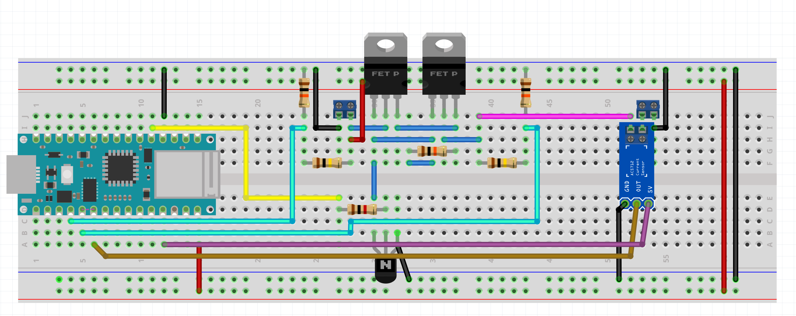

# MicroGrid Connection Unit
A device that allows to connect existing DC power systems to a small grid, e.g. to allow multiple caravans with solar systems to each other.

## Problem
Festivals and camps sometimes happen out where there is not enough electrical infrastructure to support them, so generators and other power generating equipment has to be brought. At CCCamp2015, there was the idea to at least partially solve this problem by creating micro grids. Many people bring solar systems in their campers or by other means, and sizing of those is usually above what's necessary, especially if you're out and about all day. By creating means to connect these systems and share clean solar energy with others, the dependency on fossil fuel based power generation could be reduced.

## The idea
Create a connection box that allows easily connect your own solar system to a micro grid of other similar systems. The MicroGrid Connection Unit should ensure the safety of your own system, adapt to the specifics of the microgrid in question, and allow for monitoring and statistics.

The connection unit should measure voltages on both sides of the unit (private system, the micro grid) and decide whether to provide power to the grid, or pull energy from the grid. Doing either one, it should keep track of the energy consumed or provided. It should safeguard itself and the private system by checking for over-voltage in the grid, under-voltage in the private system (to protect batteries from depletion), excessive currents and other potential dangers. The information it gathers should not only be used internally, but also provided to the user, e.g. via a WiFi or BLE interface, or longer range technologies such as LoRaWAN. It could also provide additional adaption to the grid, like DC-DC-conversion if the grid is operated at a different voltage than the private system.

## Hardware
The first prototype:

## More information
### Blog Posts as part of the "Design for a Cause" challenge
* [MicroGrid Connection Unit #1: Introduction](https://www.element14.com/community/community/design-challenges/design-for-a-cause-2021/blog/2021/04/19/microgrid-connection-unit-1-introduction)
* [MicroGrid Connection Unit #2: Design](https://www.element14.com/community/community/design-challenges/design-for-a-cause-2021/blog/2021/04/29/microgrid-connection-unit-2-design)
* [MicroGrid Connection Unit #3: First Prototype](https://www.element14.com/community/community/design-challenges/design-for-a-cause-2021/blog/2021/05/09/microgrid-connection-unit-3-first-prototype)
* [MicroGrid Connection Unit #4: Current Measurement and finding 5 V on the Nano33 IoT](https://www.element14.com/community/community/design-challenges/design-for-a-cause-2021/blog/2021/05/11/microgrid-connection-unit-4-current-measurement-and-finding-5-v-on-the-nano33-iot)
* [MicroGrid Connection Unit #5: BLE on the Nano33 IoT](https://www.element14.com/community/community/design-challenges/design-for-a-cause-2021/blog/2021/05/19/microgrid-connection-unit-5-ble-on-the-nano33-iot)
* [MicroGrid Connection Unit #6: From 5V to 3.3V](https://www.element14.com/community/community/design-challenges/design-for-a-cause-2021/blog/2021/05/25/microgrid-connection-unit-6-from-5v-to-33v)
* [MicroGrid Connection Unit #7: OLED Display & automatic calibration](https://www.element14.com/community/community/design-challenges/design-for-a-cause-2021/blog/2021/05/27/microgrid-connection-unit-7-oled-display-automatic-calibration)

### Other places
* [hackaday.io project](https://hackaday.io/project/179713-microgrid-connection-unit)
